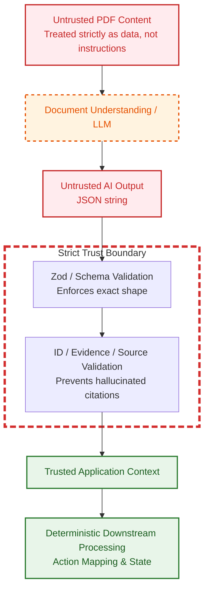

# AI Trust Boundary

This diagram illustrates the trust boundary separating untrusted user data and AI outputs from the deterministic business logic.

## Security Posture
- **No Prompt Execution:** Uploaded PDFs are parsed as raw strings. Any adversarial "Ignore previous instructions" injections inside a PDF are ingested simply as text data to be understood, incapable of controlling execution flow.
- **Strict Validation:** AI models return JSON strings. The application blindly rejects anything that fails Zod schema parsing.
- **No Autonomous Claims:** The LLM cannot invent legal authorities. `BizVal` strictly ensures that every `source_id` generated by the AI maps exactly to the authoritative list provided to it from the Legal KB in that specific request.
