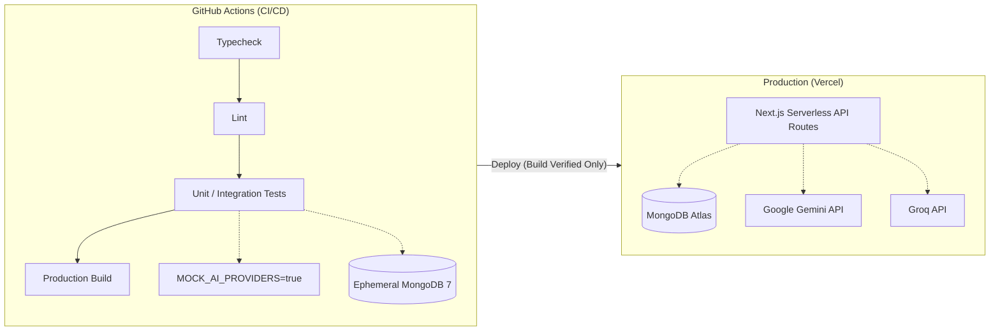

# Deployment Architecture

Vakil AI employs separate architectures for Continuous Integration (CI) and Production to ensure deterministic testability without depending on live external AI providers.

## Key Distinctions
- **Continuous Integration:** The CI pipeline runs with `MOCK_AI_PROVIDERS=true`. This deterministic execution bypasses real LLM calls and utilizes an ephemeral MongoDB container (seeded with the Legal KB via `npm run db:seed`). This ensures tests never fail due to LLM rate limits or external network outages.
- **Production Environment:** Deployed as a standard Next.js application on Vercel. Connects to real AI providers using Vercel environment variables (`GEMINI_API_KEY`, `GROQ_API_KEY`) and a hosted MongoDB Atlas cluster.
- **Vercel Execution:** Due to the complexities of running Playwright E2E tests in standard deployment previews, Vercel deployments are currently **Build Verified Only**. Full E2E regression runs locally and in the GitHub CI pipeline.
