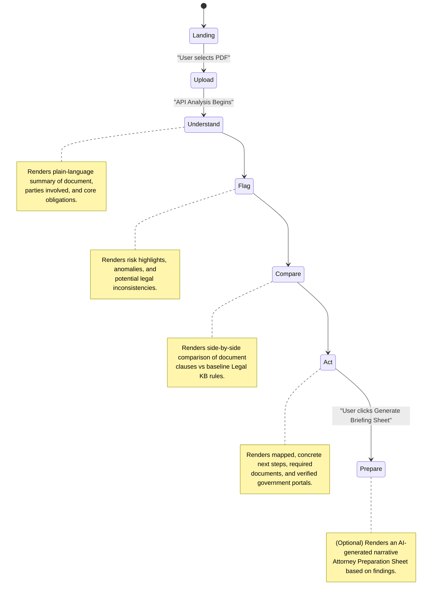

# Frontend Stage Flow

Vakil AI guides the user through a linear, non-conversational pipeline. Each stage is responsible for rendering specific outputs generated by the deterministic and AI orchestration systems.

## State Management
- **Zustand Store**: The active stage and all associated contextual data (`UnderstandingContext`, `AnalysisContext`, `ComparisonContext`, `ActionContext`, `PrepareContext`) are managed in an ephemeral client-side Zustand store.
- **Session Isolation**: Uploading a new document immediately clears all previous state, ensuring zero cross-contamination between document reviews.
