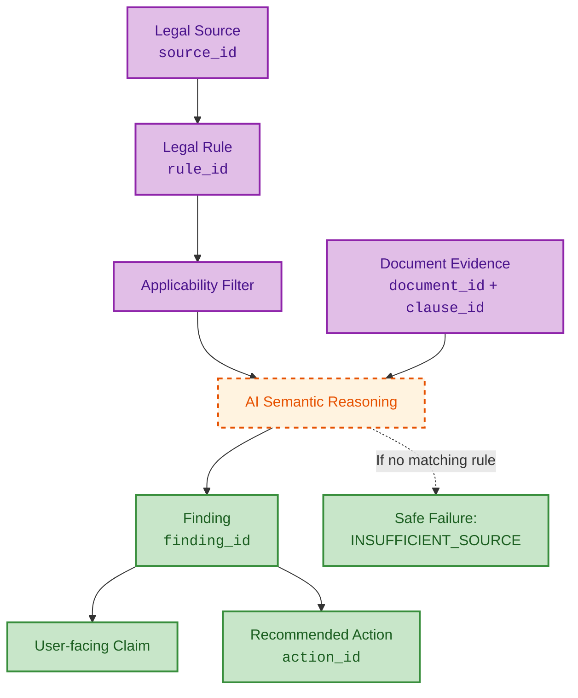

# Legal Reasoning & Evidence Chain

This diagram demonstrates how substantive legal claims trace their provenance back to verifiable sources and exact document clauses.

## Traceability Principles
1. **Evidence Before Claims**: The AI cannot generate a `Finding` without explicitly mapping it to an array of valid `clause_ids` and `rule_ids`.
2. **Safe Failure**: If the Knowledge Base lacks sufficient authority to evaluate a clause, the system returns `INSUFFICIENT_SOURCE` rather than hallucinating a legal conclusion.
