# End-to-End Legal Analysis Pipeline

The V1 reasoning pipeline separates operations into deterministic systems (business logic, rule application, schema enforcement) and AI-assisted systems (semantic extraction, narrative generation). 

> **Core Architectural Principle:** AI for reasoning; deterministic systems for deterministic work.

```mermaid
flowchart TD
    %% Define Styles
    classDef deterministic fill:#e3f2fd,stroke:#1565c0,stroke-width:2px,color:#0d47a1
    classDef ai fill:#fff3e0,stroke:#e65100,stroke-width:2px,stroke-dasharray: 5 5,color:#e65100
    classDef data fill:#f5f5f5,stroke:#9e9e9e,stroke-width:1px
    
    %% Nodes
    PDF[Raw PDF Document]:::data
    Extract[PDF.js Extraction]:::deterministic
    DocCtx[DocumentContext]:::data
    
    Classify["Deterministic Classification<br>Threshold/Regex Matching"]:::deterministic
    Understand["Document Understanding<br>Semantic Interpretation (Gemini)"]:::ai
    UndCtx[UnderstandingContext]:::data
    
    Applicability["Deterministic Legal Applicability<br>Temporal/Jurisdictional DB Query"]:::deterministic
    Flag["Semantic Comparison/Reasoning<br>Risk Flagging (Groq)"]:::ai
    AnaCtx[AnalysisContext]:::data
    
    Compare["Legal Baseline Comparison<br>(Groq)"]:::ai
    CompCtx[ComparisonContext]:::data
    
    Act["Action Mapping<br>Deterministic Rules -> Next Steps"]:::deterministic
    ActCtx[ActionContext]:::data
    
    Prepare["Preparation Drafting<br>Narrative Generation (Gemini)"]:::ai
    PrepCtx[Optional PrepareContext]:::data

    %% Edges
    PDF --> Extract
    Extract --> DocCtx
    DocCtx --> Classify
    Classify --> Understand
    Understand --> UndCtx
    UndCtx --> Applicability
    Applicability --> Flag
    Flag --> AnaCtx
    AnaCtx --> Compare
    Compare --> CompCtx
    CompCtx --> Act
    Act --> ActCtx
    ActCtx -.-> |User Opt-in| Prepare
    Prepare -.-> PrepCtx
```

## Subsystems

### Deterministic Systems (Solid Blue)
- **Document Classification:** Employs non-backtracking regular expressions to classify documents (e.g. `RENTAL_LEASE`) based on a deterministic threshold score.
- **Legal Applicability:** Queries MongoDB filtering by jurisdiction, document type, and effective dates.
- **Action Mapping:** Converts structured findings into deterministic action routes without LLM hallucinations.
- **Schema & State Transitions:** Enforced strictly via Zod across the pipeline.

### AI-Assisted Systems (Dashed Orange)
- **Document Understanding:** Gemini parses raw text into a rigid factual schema (parties, obligations, dates).
- **Semantic Comparison/Reasoning:** Groq analyzes context against the selected deterministic legal rules to highlight risks or gaps.
- **Preparation Drafting:** Gemini synthesizes the structured analysis into a human-readable briefing sheet for lawyers.
