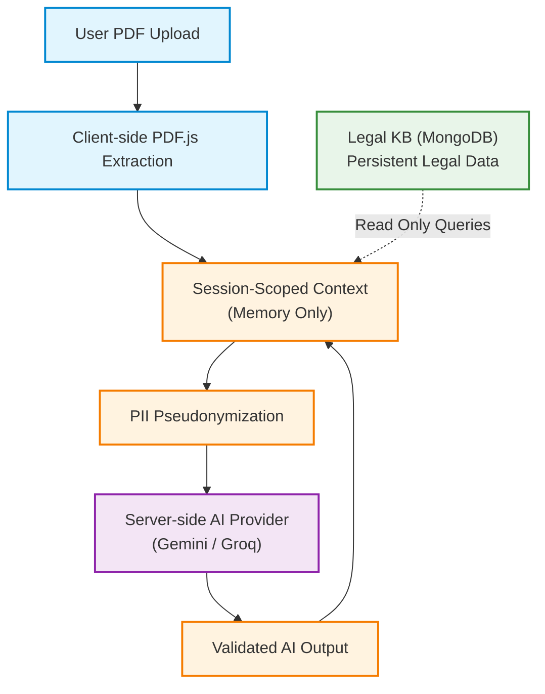

# Security & Privacy Architecture

This diagram illustrates how user data is protected through strict session scoping, pseudonymization, and separation from the persistent Knowledge Base.

## Privacy Guarantees
- **No Persistent User Storage**: Uploaded documents and generated session contexts are stored purely in transient memory during the analysis. They are NOT written to the MongoDB Legal KB.
- **Client-Side Extraction**: PDF files are never uploaded to the server; only the extracted text payload is transmitted.
- **Server-Side AI Credentials**: Provider API keys (`GEMINI_API_KEY`, `GROQ_API_KEY`) are kept entirely server-side. The Next.js client never communicates directly with LLMs.
- **PII Pseudonymization**: Where practical, names and identifying details are pseudonymized before being sent to the AI provider.
