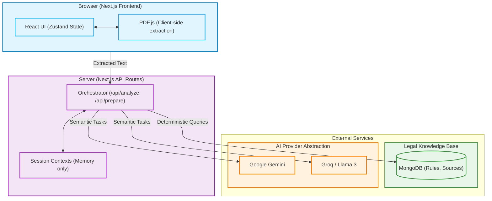

# System Architecture

The Vakil AI architecture strictly separates the client-side UI, server-side orchestration, AI models, and the deterministic Legal Knowledge Base. This boundary ensures API keys are protected and that the AI cannot manipulate the authoritative legal rules.

## Key Boundaries
1. **Client/Server**: PDF text extraction occurs entirely in the browser (`PDF.js`). The raw text is sent to the server for processing.
2. **Server/AI**: API keys and prompts are strictly managed server-side. The client never interacts with the LLMs directly.
3. **AI/DB**: The AI providers have *no access* to query MongoDB. The orchestration layer fetches the applicable rules deterministically and passes only the relevant text as context to the AI.
